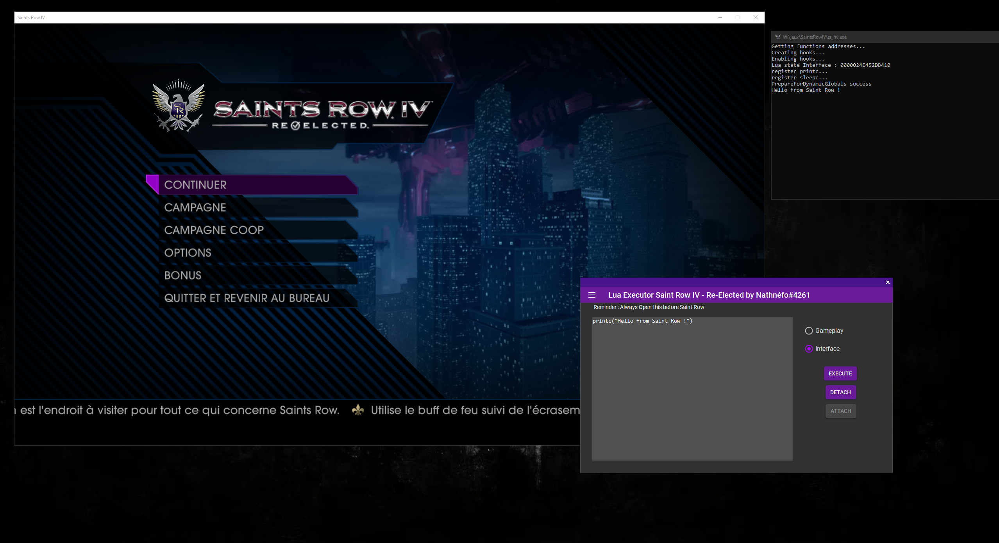

# SaintExec 

SaintExec is a lua executor for Saint Row IV Re-Elected.

## Status
Epic games Version : **Working**.\
Steam Version : **Untested**. (contact me on discord Nathnéfo#4261)

## How to use
Download the lastest release. **Open the injector before lauching the game**,  choose gameplay or interface (gameplay can only be executed in-game !) and execute the script. \

## How to create a script ?
I will post a tutorial on [saintsrowmods.com](https://www.saintsrowmods.com).\
To wait, here is a little script to inject into Gameplay (It makes your car invulnerable !): 

    while true do
      local chr = get_char_vehicle_name(LOCAL_PLAYER)
      if chr ~= "" then
        vehicle_set_invulnerable(chr)
      end
      sleepc(1000)
    end

## Known Issues
- Callback functions like *on_vehicle_enter* crash the game.
- When you go in-game, in the main menu and in-game again the injector don't work.
- Crash when calling *printc* too many times.

## Roadmap

- [ ] Repair Issues.
- [ ] Add the ability to dump lua scripts.
- [ ] Make a Hook function inside lua.

## Credit

A huge thank to [ElCapor](https://github.com/ElCapor) how help me a lot (This project would not be possible without him), the website [saintsrowmods.com](https://www.saintsrowmods.com) for the many resources on it contains and the library [MinHook](https://github.com/TsudaKageyu/minhook).\
Project inspiration : [sr4---hook](https://github.com/ElCapor/sr4---hook), [Axon](https://github.com/rakion99/Axon/tree/4e6773e8e0dfaa6003439a2dabb0a2748d9384ac).
