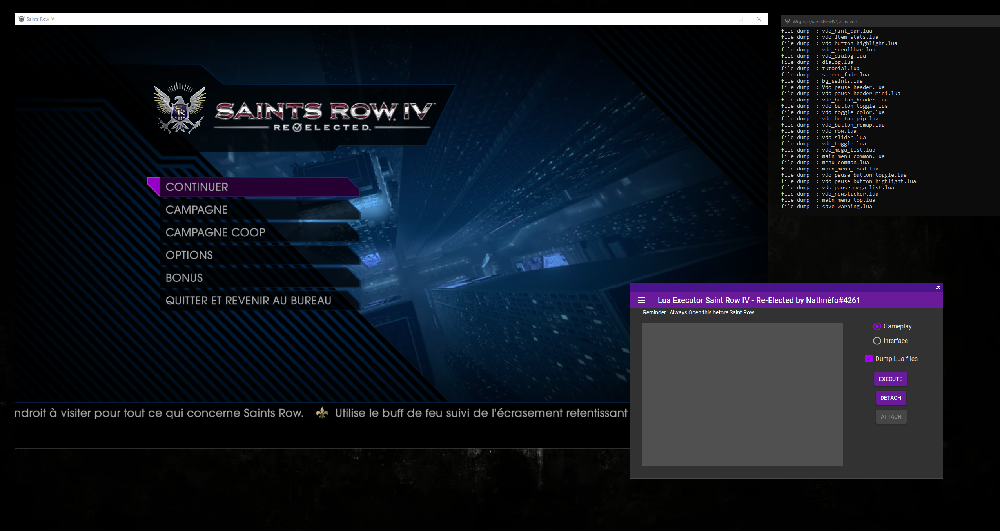

# SaintExec 

SaintExec is a lua executor for Saint Row IV Re-Elected.

## Status
Epic games Version : **Working**.\
Steam Version : **Untested**. (contact me on discord Nathnéfo#4261)

## How to use
Download the lastest release. **Open the injector before lauching the game**,  choose gameplay or interface (gameplay can only be executed in-game !) and execute the script.

## How to create a script ?
I will post a tutorial on [saintsrowmods.com](https://www.saintsrowmods.com).\
To wait, here is a little script to inject into Gameplay (It makes your car invulnerable !): 

    function make_invulnerable(player_name, vehicle_name, i)
        vehicle_set_invulnerable(vehicle_name)
    end

    on_vehicle_enter("make_invulnerable", LOCAL_PLAYER)

## Known Issue
- Crash when calling *printc* too many times (Add a delay between with sleepc).

## Roadmap

- [X] Repair Issues.
- [ ] Add the ability to dump lua scripts.
- [ ] Make a tutorial.
- [ ] Make a Hook function inside lua.

## Credit

A huge thank to [ElCapor](https://github.com/ElCapor) how help me a lot (This project would not be possible without him), the website [saintsrowmods.com](https://www.saintsrowmods.com) for the many resources on it contains and the library [MinHook](https://github.com/TsudaKageyu/minhook).\
Project inspiration : [sr4---hook](https://github.com/ElCapor/sr4---hook), [Axon](https://github.com/rakion99/Axon/tree/4e6773e8e0dfaa6003439a2dabb0a2748d9384ac).
